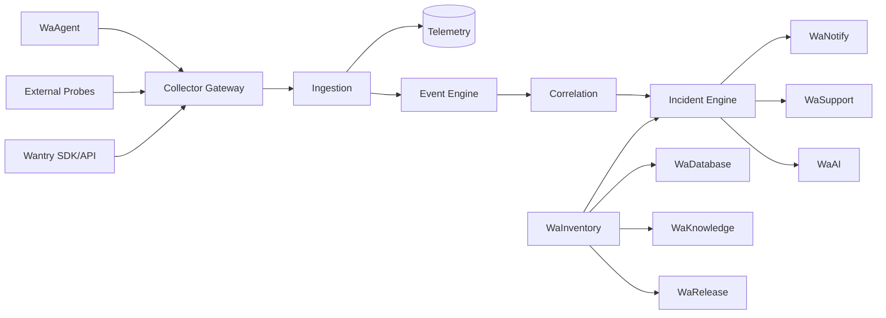

# WAOPS MASTER SPEC

## 1. Produto

WaOPS é a plataforma SaaS modular de operações da Wasync para infraestrutura, aplicações, bancos, incidentes, suporte, documentação, backup, releases, notificações e IA.



## 2. Fundamentos desde o primeiro commit

- tenant isolation;
- memberships/RBAC;
- module registry;
- feature flags técnicas;
- entitlements;
- quotas/usage;
- resource catalog;
- event envelope;
- incident timeline;
- secrets abstraction;
- audit;
- agent protocol/version;
- idempotency;
- outbox/inbox;
- migration policy;
- retention model.

## 3. Design authority

`designer.md` é a autoridade visual e UX do WaOPS.

### designer.md controla
- layout;
- visual hierarchy;
- spacing;
- colors;
- typography;
- components;
- sidebar/header;
- dashboards;
- tables;
- charts;
- modals;
- forms;
- responsive behavior;
- animations.

### designer.md não pode sobrescrever
- tenant isolation;
- RBAC;
- entitlements;
- billing;
- API behavior;
- domain state machines;
- security;
- storage;
- audit.

### Precedência
1. Segurança
2. ADR
3. Contratos
4. Especificação funcional
5. Master Spec
6. designer.md
7. preferência do desenvolvedor

## 4. Multi-tenancy

```text
Platform Root
└── Tenant
    ├── Teams
    ├── Memberships
    ├── Resources
    ├── Entitlements
    └── Organizations/Subtenants [MSP add-on]
```

Toda entidade/consulta/cache/job/realtime/storage de cliente deve ser tenant-scoped.

## 5. Core

Sempre disponível:
- Identity
- Tenancy
- RBAC
- Billing State
- Entitlements
- Quotas
- WaInventory
- Events
- Incidents
- Audit
- Secrets references

## 6. Módulos adicionais

- WaMonitor
- WaSupport
- Wantry
- WaDatabase
- WaBackup
- WaKnowledge
- WaNotify
- WaRelease
- WaAI

## 7. Agente

- Go
- Linux
- Windows
- Docker quando disponível
- read-only na primeira fase
- sem inbound connection obrigatório
- agente inicia comunicação outbound via HTTPS
- enrollment seguro
- signed updates
- bounded offline buffer

## 8. Event model

```text
Metric/Signal
→ Rule
→ Event
→ Dedup/Fingerprint
→ Suppression
→ Correlation
→ Incident
→ optional Ticket / Notification / AI Context
```

Nem toda métrica vira evento.  
Nem todo evento vira incidente.  
Nem todo incidente vira ticket.

## 9. Billing

Separar:
- feature flag;
- entitlement;
- quota;
- usage;
- override.

Providers:
- manual;
- Mercado Pago;
- Asaas.

## 10. Ambientes

### Local
Docker local com serviços necessários para desenvolvimento/teste.

### Produção
Docker/Swarm + Traefik + PostgreSQL/Timescale + Redis + object storage.

Produção nunca é sandbox de desenvolvimento.

## 11. Engenharia agentic

Agentes de IA devem obedecer `AGENTS.md`, `TOOL_PERMISSIONS.md`, skills e contratos.

## 12. Contratos executáveis

Contratos são mantidos em:
- `contracts/events/`
- `contracts/agent/`
- `contracts/permissions/`
- `contracts/entitlements/`
- `contracts/plugins/`

Eles têm precedência sobre exemplos informais em documentação.
