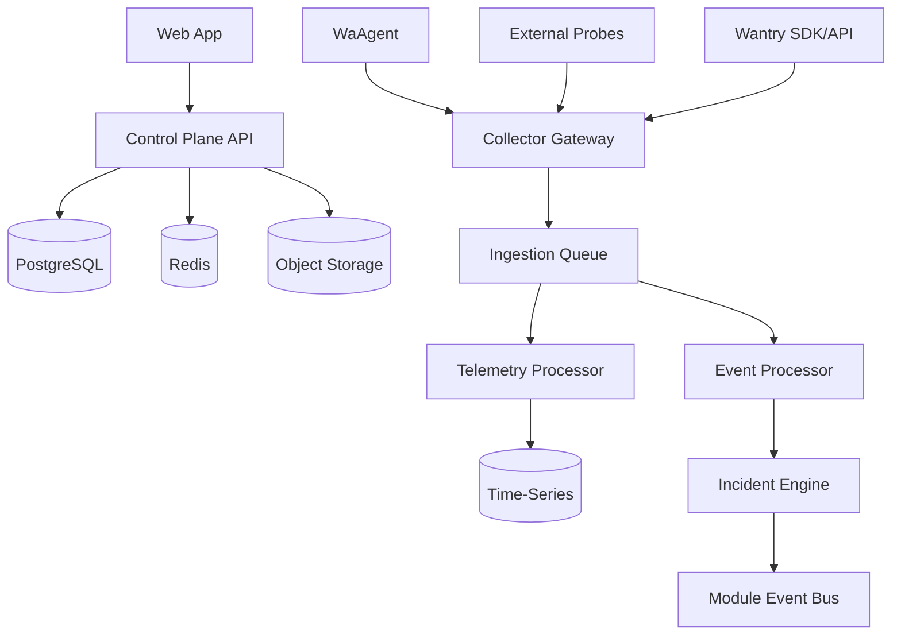

# System Architecture

## 1. Áreas principais

## 2. Control Plane

Responsável por:
- auth
- tenancy
- users/memberships
- RBAC
- entitlements
- plans/billing
- resource catalog
- monitor definitions
- incident state
- support
- docs
- integrations

## 3. Collector Gateway

Responsável por:
- autenticar agente/probe/SDK
- derivar tenant da credencial
- validar schema/version
- aplicar rate limit
- limitar payload
- normalizar envelope
- publicar para fila

Não deve concentrar lógica pesada de negócio.

## 4. Event Bus

Primeira implementação pode usar Redis/BullMQ + outbox.
Contratos devem permitir futura migração para broker dedicado.

## 5. Storage

- PostgreSQL: control plane
- TimescaleDB/PostgreSQL: métricas
- Redis: cache/queues
- S3-compatible: anexos, artefatos, backups
- ClickHouse: futuro, por necessidade

## 6. Realtime

- WebSocket ou SSE
- tenant-scoped channels
- pub/sub adapter para escala horizontal
- sem sticky session como requisito de negócio
